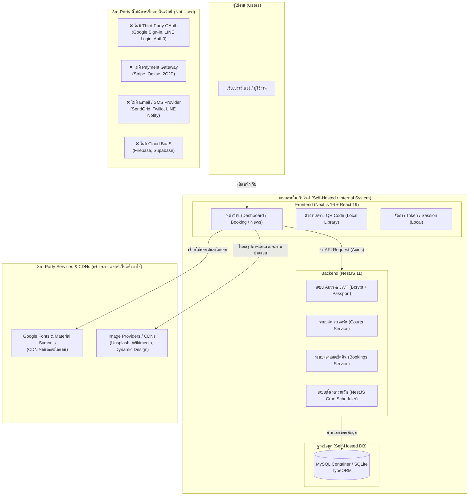

# Book-a-Badminton_Court
ระบบจองคอร์ดแบดมินตันภายในองค์กร

---

## 📌 การวิเคราะห์การใช้งาน 3rd Party (Third Party) ในระบบ

**3rd Party (บุคคลภายนอก หรือ ผู้ให้บริการภายนอก)** ในบริบทของระบบเว็บไซต์ คือ บุคคล องค์กร หรือผู้ให้บริการภายนอกที่ไม่ได้เป็นเจ้าของเว็บไซต์โดยตรง แต่เข้ามามีส่วนร่วมในการให้บริการ API, เครื่องมือ หรือโครงสร้างพื้นฐานเสริมบนเว็บไซต์

---

### 1. แผนภาพสถาปัตยกรรมและการเชื่อมต่อ 3rd Party (Architecture & 3rd Party Diagram)

---

### 2. รายการ 3rd Party ที่ "มี" การใช้งานในระบบ (Used 3rd-Party)

| ประเภท 3rd Party | ผู้ให้บริการ / เครื่องมือ | รายละเอียดและหน้าที่การทำงาน |
| :--- | :--- | :--- |
| **1. Font & Icon CDN Services** | **Google Fonts & Material Symbols** | ดึงฟอนต์ `Inter` และไอคอน `Material Symbols Outlined` ผ่าน CDN (`fonts.googleapis.com`) สำหรับตกแต่งหน้าตา UI |
| **2. External Image / Media CDNs** | **Unsplash / Wikimedia / Dynamic Design** | ดึงภาพประกอบพื้นหลังและโลโก้จากภายนอกมาแสดงผลบนหน้าเว็บไซต์ เช่น ภาพคอร์ดแบดมินตัน และภาพนักกีฬา |
| **3. Open-Source Libraries (Client-side / In-App Engine)** | **`html5-qrcode` & `react-qr-code`** | ไลบรารีภายนอกสำหรับเปิดกล้องอุปกรณ์เพื่อสแกน QR Code และสร้าง QR Code หน้าคอร์ด (ประมวลผลภายในเครื่องผู้ใช้) |
| | **`framer-motion` & `tsparticles`** | ไลบรารีสำหรับสร้าง Animation และลูกเล่น Particle บนหน้า UI |

---

### 3. รายการ 3rd Party ที่ "ไม่มี" การใช้งานในระบบ (Not Used)

1. **ไม่มี Payment Gateway ภายนอก** (เช่น Stripe, Omise, GB Prime Pay, 2C2P)
   - *เหตุผล:* ระบบออกแบบมาสำหรับการจองคอร์ดภายในองค์กร จึงไม่มีการเชื่อมต่อระบบตัดเงินหรือ API ธนาคารภายนอก
2. **ไม่มี Third-Party Authentication / OAuth** (เช่น Google Login, Facebook Login, LINE Login, Firebase Auth, Auth0)
   - *เหตุผล:* ระบบพัฒนาการยืนยันตัวตนแบบ Self-Hosted JWT Token ร่วมกับการเข้ารหัสรหัสผ่านด้วย `bcrypt` ภายในเซิร์ฟเวอร์ NestJS เอง
3. **ไม่มี Notification / Email / SMS Gateway ภายนอก** (เช่น SendGrid, Twilio, LINE Notify, Pusher)
   - *เหตุผล:* การจัดการสถานะการจองหมดอายุและรีเซ็ตสถานะคอร์ดใช้ระบบ Schedule/Cron Job ภายในตัว NestJS (`@nestjs/schedule`)
4. **ไม่มี Cloud Database / BaaS ภายนอก** (เช่น Firebase Firestore, Supabase, MongoDB Atlas)
   - *เหตุผล:* ข้อมูลทั้งหมดถูกจัดเก็บในฐานข้อมูล MySQL ที่รันผ่าน Docker หรือ SQLite ที่โฮสต์อยู่ภายในเครื่องเซิร์ฟเวอร์เอง
