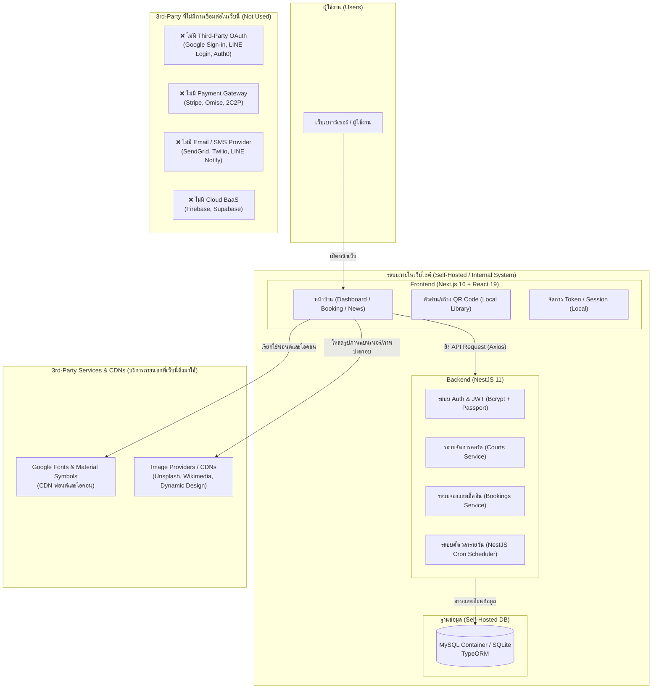

# Book-a-Badminton_Court
ระบบจองคอร์ดแบดมินตันภายในองค์กร

---

## 📌 การวิเคราะห์การใช้งาน 3rd Party (Third Party) ในระบบ

**3rd Party (บุคคลภายนอก หรือ ผู้ให้บริการภายนอก)** ในบริบทของระบบเว็บไซต์ คือ บุคคล องค์กร หรือผู้ให้บริการภายนอกที่ไม่ได้เป็นเจ้าของเว็บไซต์โดยตรง แต่เข้ามามีส่วนร่วมในการให้บริการ API, เครื่องมือ หรือโครงสร้างพื้นฐานเสริมบนเว็บไซต์

---

### 1. แผนภาพสถาปัตยกรรมและการเชื่อมต่อ 3rd Party (Architecture & 3rd Party Diagram)



---

### 2. รายการ 3rd Party ที่ "มี" การใช้งานในระบบ (Used 3rd-Party)

| ประเภท 3rd Party | ผู้ให้บริการ / เครื่องมือ | รายละเอียดและหน้าที่การทำงาน |
| :--- | :--- | :--- |
| **1. Font & Icon CDN Services** | **Google Fonts & Material Symbols** | ดึงฟอนต์ `Inter` และไอคอน `Material Symbols Outlined` ผ่าน CDN (`fonts.googleapis.com`) สำหรับตกแต่งหน้าตา UI |
| **2. External Image / Media CDNs** | **Unsplash / Wikimedia / Dynamic Design** | ดึงภาพประกอบพื้นหลังและโลโก้จากภายนอกมาแสดงผลบนหน้าเว็บไซต์ เช่น ภาพคอร์ดแบดมินตัน และภาพนักกีฬา |
| **3. Open-Source Libraries (Client-side / In-App Engine)** | **`html5-qrcode` & `react-qr-code`** | ไลบรารีภายนอกสำหรับเปิดกล้องอุปกรณ์เพื่อสแกน QR Code และสร้าง QR Code หน้าคอร์ด (ประมวลผลภายในเครื่องผู้ใช้) |
| | **`framer-motion` & `tsparticles`** | ไลบรารีสำหรับสร้าง Animation และลูกเล่น Particle บนหน้า UI |

---

### 3. รายการ 3rd Party ที่ "ไม่มี" การใช้งานในระบบ (Not Used)

1. **ไม่มี Payment Gateway ภายนอก** (เช่น Stripe, Omise, GB Prime Pay, 2C2P)
   - *เหตุผล:* ระบบออกแบบมาสำหรับการจองคอร์ดภายในองค์กร จึงไม่มีการเชื่อมต่อระบบตัดเงินหรือ API ธนาคารภายนอก
2. **ไม่มี Third-Party Authentication / OAuth** (เช่น Google Login, Facebook Login, LINE Login, Firebase Auth, Auth0)
   - *เหตุผล:* ระบบพัฒนาการยืนยันตัวตนแบบ Self-Hosted JWT Token ร่วมกับการเข้ารหัสรหัสผ่านด้วย `bcrypt` ภายในเซิร์ฟเวอร์ NestJS เอง
3. **ไม่มี Notification / Email / SMS Gateway ภายนอก** (เช่น SendGrid, Twilio, LINE Notify, Pusher)
   - *เหตุผล:* การจัดการสถานะการจองหมดอายุและรีเซ็ตสถานะคอร์ดใช้ระบบ Schedule/Cron Job ภายในตัว NestJS (`@nestjs/schedule`)
4. **ไม่มี Cloud Database / BaaS ภายนอก** (เช่น Firebase Firestore, Supabase, MongoDB Atlas)
   - *เหตุผล:* ข้อมูลทั้งหมดถูกจัดเก็บในฐานข้อมูล MySQL ที่รันผ่าน Docker หรือ SQLite ที่โฮสต์อยู่ภายในเครื่องเซิร์ฟเวอร์เอง

---

## 📌 วิธีการรันระบบเพื่อทดสอบในเครื่อง (Local Development)

สามารถเลือกรันระบบได้ 2 วิธี คือผ่าน Docker Compose (แนะนำ) หรือรันแยกส่วนด้วยตนเอง

### วิธีที่ 1: รันผ่าน Docker Compose (ง่ายและแนะนำ)
เหมาะสำหรับการรันระบบทั้งหมดขึ้นมาพร้อมกันโดยไม่ต้องตั้งค่าฐานข้อมูลแยก

**สิ่งที่ต้องมี:** ติดตั้ง [Docker Desktop](https://www.docker.com/products/docker-desktop/) ในเครื่อง

1. เปิด Terminal (หรือ Command Prompt / PowerShell)
2. เข้าไปที่โฟลเดอร์หลักของโปรเจกต์ (`C:\Nestjs demo\Badmintor court` หรือโฟลเดอร์ที่เก็บไฟล์ `docker-compose.yml`)
3. รันคำสั่งต่อไปนี้เพื่อสร้างและรัน Container ทั้งหมด:
   ```bash
   docker-compose up -d --build
   ```
4. รอจนกว่าระบบจะรันเสร็จ (จะมีการดาวน์โหลด image และ build หน้าเว็บ)
5. **การเข้าใช้งาน:**
   - **Frontend (หน้าเว็บผู้ใช้):** เข้าถึงได้ที่ `http://localhost:3001`
   - **Backend API:** รันอยู่ที่ `http://localhost:4001`
   - **MySQL Database:** พอร์ต `3306`

*(หากต้องการหยุดการทำงาน ให้ใช้คำสั่ง `docker-compose down`)*

---

### วิธีที่ 2: รันแยกส่วนทีละโปรเจกต์ (Manual Setup)
เหมาะสำหรับนักพัฒนาที่ต้องการแก้ไขโค้ดและดูผลลัพธ์แบบ Real-time (Hot Reload)

**สิ่งที่ต้องมี:** ติดตั้ง [Node.js](https://nodejs.org/) (แนะนำเวอร์ชัน 18 ขึ้นไป) และฐานข้อมูล MySQL (หรือใช้ Docker รันเฉพาะ MySQL)

#### 1. การรันฐานข้อมูล MySQL
สามารถรัน MySQL แยกผ่าน Docker โดยใช้คำสั่ง:
```bash
docker-compose up -d mysql
```
*(การตั้งค่า Database จะอยู่ในไฟล์ `docker-compose.yml` ได้แก่ Database: `badminton_db`, User: `badminton_user`, Password: `password`)*

#### 2. การรัน Backend (NestJS)
เปิด Terminal ใหม่แล้วรันคำสั่ง:
```bash
cd backend
npm install
npm run start:dev
```
*(Backend จะทำงานที่พอร์ต 4000)*

#### 3. การรัน Frontend (Next.js)
เปิด Terminal ใหม่อีกหน้าต่างแล้วรันคำสั่ง:
```bash
cd frontend
npm install
npm run dev
```
*(Frontend จะทำงานที่พอร์ต 3000)*

**การเข้าใช้งานสำหรับวิธีนี้:**
- **Frontend:** `http://localhost:3000`
- **Backend:** `http://localhost:4000`

---

## 📌 การทำงานของเว็บไซต์ (System Workflow)

ระบบนี้ถูกออกแบบมาเพื่อเป็นแอปพลิเคชันสำหรับการจองคอร์ดแบดมินตัน โดยแบ่งการทำงานออกเป็น 3 ส่วนหลัก ดังนี้:

### 1. Frontend (Next.js 16 + React 19)
- **หน้าที่:** เป็นส่วนติดต่อผู้ใช้ (UI) ที่ให้ผู้ใช้งานคลิกดูข้อมูลคอร์ด เลือกวันเวลา และทำการจองคอร์ด
- **การทำงาน:** 
  - เมื่อผู้ใช้เข้ามาที่เว็บไซต์ หน้าเว็บจะทำการดึงข้อมูล (Fetch API) จาก Backend ผ่านทางไลบรารีอย่าง Axios
  - มีหน้าจอสำหรับการล็อกอิน (Login) และจัดการเซสชันของผู้ใช้ (เก็บ Token ไว้ในระบบของเบราว์เซอร์)
  - มีเครื่องมือสำหรับสแกนและสร้าง QR Code (`html5-qrcode`, `react-qr-code`) สำหรับใช้ในการเช็คอินเข้าคอร์ด

### 2. Backend API (NestJS 11)
- **หน้าที่:** เป็นมันสมองของระบบที่คอยรับคำสั่งจาก Frontend ตรวจสอบความถูกต้อง และจัดการข้อมูลในฐานข้อมูล
- **การทำงานหลักๆ:**
  - **Auth Module:** จัดการการล็อกอิน ยืนยันตัวตน และออก JWT Token เพื่อให้แน่ใจว่าผู้ใช้งานมีสิทธิ์เข้าถึงข้อมูล
  - **Courts & Booking Module:** จัดการข้อมูลคอร์ดว่าง การจองคอร์ดใหม่ และการตรวจสอบว่าคอร์ดทับซ้อนกันหรือไม่
  - **Cron / Scheduler Module:** ระบบจะมีการตั้งเวลาตรวจสอบอัตโนมัติ (เช่น ทุกๆ นาทีหรือชั่วโมง) เพื่อยกเลิกการจองที่หมดเวลาเช็คอิน หรือรีเซ็ตคอร์ดที่ใช้งานเสร็จแล้ว

### 3. Database (MySQL)
- **หน้าที่:** เป็นที่เก็บข้อมูลทั้งหมดของระบบอย่างถาวร เช่น ข้อมูลผู้ใช้ ข้อมูลคอร์ด และประวัติการจอง
- **การทำงาน:** Backend จะใช้ TypeORM ในการแปลคำสั่ง TypeScript ให้เป็น SQL เพื่อดึงข้อมูลหรือบันทึกข้อมูลลงฐานข้อมูล

### 🔄 ภาพรวมการไหลของข้อมูล (Basic Data Flow)
1. **User** เข้าสู่ระบบผ่านเบราว์เซอร์ (Frontend)
2. **Frontend** ส่ง Username/Password ไปที่ **Backend**
3. **Backend** ตรวจสอบกับ **Database** และส่ง JWT Token กลับมาให้ Frontend
4. **User** เลือกเวลาและกดจองคอร์ด
5. **Frontend** ส่งข้อมูลการจอง (พร้อม Token) ไปที่ **Backend**
6. **Backend** ตรวจสอบว่าคอร์ดว่างหรือไม่ หากว่างจะบันทึกข้อมูลลง **Database** และส่งสถานะ "สำเร็จ" กลับไป
7. **Frontend** อัปเดตหน้าจอแสดงผลว่า "จองคอร์ดสำเร็จแล้ว"
